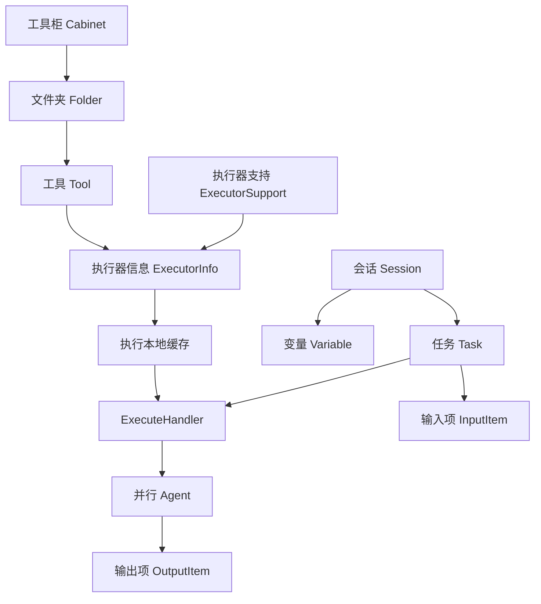

# toolhouse

Toolhouse 是一款开箱即用的基于配置的工具库，能够将常见处理过程定义成可复用的工具，并调度这些工具执行。

工具化处理是一个较为抽象的概念，但在实际应用中有着广泛的应用，例如以下场景：

- 将业务报表从一种格式转换为另一种格式，并保留转换后的文件。
- 根据一组业务参数完成计算，得到可以直接使用的结果。
- 在连续处理中保留中间状态，使后续处理可以继续使用。

在上述例子中，虽然场景各不相同，但都可以将其抽象为以下过程：

```text
组织工具 -> 配置执行器 -> 建立会话与任务 -> 写入输入 -> 执行 -> 读取输出
```

Toolhouse 服务将上述过程中的 `配置执行器`、`执行` 两个环节进行封装，并将生成的执行结果交给后续使用。
Toolhouse 服务可以用于搭建文件处理、参数计算、会话状态延续等各类自定义工具。

Toolhouse 服务以 `工具(Tool)` 为核心，可以维护大量工具，其中对每个工具可以分别维护执行规则。

Toolhouse 服务为工具执行等作业逻辑封装了标准的接口，并维护了这些接口的调用逻辑，用户只需实现这些接口，
即可将其处理逻辑接入 Toolhouse 服务中。
Toolhouse 服务内置了（或者将要内置）Groovy 执行器与模拟执行器，用户可以直接使用这些执行器；
同时，Toolhouse 服务也提供了 SPI 机制，用户可以将其自定义的执行器封装为 jar 包并放置在 `libext` 目录下，通过可选配置 `opt`
装入后使用。

对于较大数量的工具，或是耗时较长的执行逻辑，Toolhouse 服务可以将其负载均衡至多个工作节点上进行处理，
其可以在很大的数据量下，仍然保持较低的延迟与较高的吞吐。

---

## 特性

- 实现工具执行的调度框架，内置多种接口实现工具定义与执行的标准化调度逻辑。
- 基于执行器接口执行工具，同一工具下的多个执行器并行执行。
- 以会话和任务组织一次工具使用，任务进度可视。
- 使用可视化机制，对工具执行结果进行可视化处理。
- 对任务执行过程中产生的输入项、变量、输出项和文件进行存储与管理。
- 内置 Groovy 执行器与模拟执行器，支持用户自定义执行器。
- 提供 Telqos 运维平台，能够在没有 GUI 的环境下使用本服务的功能。
- 支持主流关系型数据库（基于 Hibernate）。
- 支持分布式部署。

## 系统架构

Toolhouse 服务的系统架构如下图所示：



## 文档

该项目的文档位于 [docs](../../../docs) 目录下，包括：

### wiki

wiki 为项目的开发人员为本项目编写的详细文档，包含不同语言的版本，主要入口为：

1. [简介](./Introduction.md) - 即本文件。
2. [目录](./Contents.md) - 文档目录。
